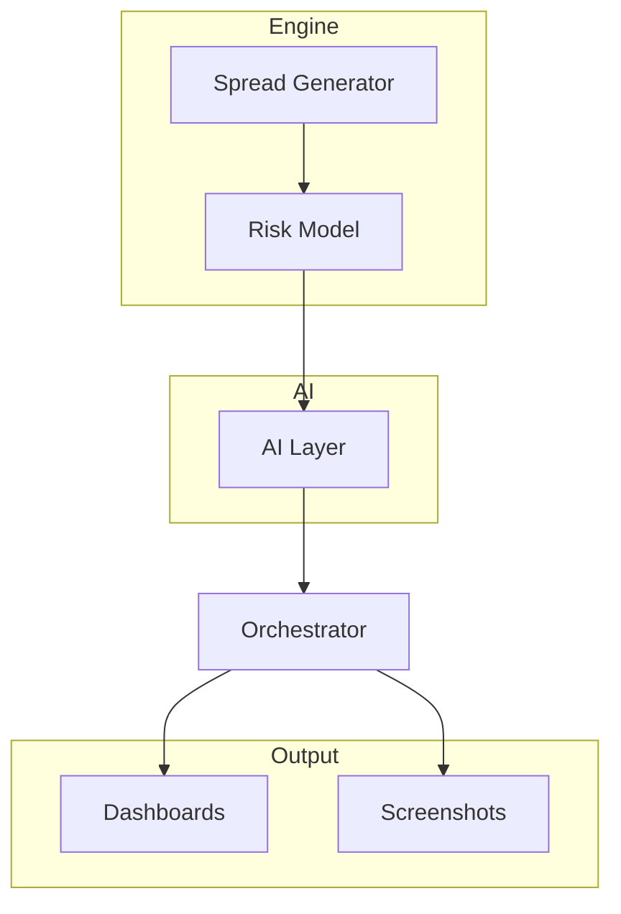

Balanced Harvester Engine for /MCL Futures (AI‑Assisted)


The Balanced Harvester is a modular, AI‑assisted trading engine designed to evaluate
Micro Crude Oil (/MCL) vertical spreads using a structured pipeline:
Spread Generation
Risk Modeling
AI Explanation Layer
Orchestration & Output
Dashboards & Screenshots
This repository provides a clean, extensible architecture suitable for:
Futures spread evaluation
Risk envelope validation
AI‑assisted trade summaries
Notebook‑based dashboards
Modular component upgrades
---
🧩 Architecture Overview

📁 Repository Structure
```
balanced-harvester/
│
├── engine/
│   ├── spread_generator.py
│   ├── risk_model.py
│   └── examples/
│       ├── sample_chain.csv
│       └── sample_spreads.json
│
├── ai_layer/
│   ├── evaluator.py
│   ├── trade_explainer_prompt.txt
│   └── risk_summary_prompt.txt
│
├── schemas/
│   ├── spread_schema.json
│   └── risk_schema.json
│
├── orchestrator/
│   ├── harvester.py
│   └── __init__.py
│
├── dashboards/
│   ├── harvester_notebook.ipynb
│   └── harvester_dashboard.png
│
└── screenshots/
    ├── engine_flow.png
    └── dashboard_view.png
```
